<div align="center">

<!-- Interactive Terminal Profile Banner -->
<a href="https://github.com/AdeshDeshmukh">
  <picture>
    <source media="(prefers-color-scheme: dark)" srcset="profile-banner-v2-dark.svg">
    <source media="(prefers-color-scheme: light)" srcset="profile-banner-v2-light.svg">
    
  </picture>
</a>
<br><br>

<!-- Live Retro Space Defender Jet Heatmap -->
<p align="center">
  
</p>
<br>

</div>

---

### 💻 `adesh@deshmukh-node-01:~$ neofetch --system-info`

```text
  ██████╗ ██████╗ ███████╗███████╗██╗  ██╗
 ██╔════╝██╔═══██╗██╔════╝██╔════╝██║  ██║   Adesh Deshmukh
 ██║     ██║   ██║███████╗█████╗  ███████║   ----------------------------------------
 ██║     ██║   ██║╚════██║██╔══╝  ██╔══██║   [OS]        Linux x86_64 / Cloud-Native Node
 ╚██████╗╚██████╔╝███████║███████╗██║  ██║   [Kernel]    Go 1.22+ / C++20 / Python 3.12
  ╚═════╝ ╚═════╝ ╚══════╝╚══════╝╚═╝  ╚═╝   [Role]      Systems & Backend Engineer
                                             [Focus]     Kubernetes, Observability, Tooling
                                             [CNCF]      58+ Merged PRs across 12 Repos
                                             [Status]    Active Contributor @ kubernetes-sigs
```

---

### 🏛️ Architectural Stack Layers

```
 ┌─────────────────────────────────────────────────────────────────────────────────┐
 │ Layer 3: Application Services & Interfaces                                      │
 │ Python  ·  TypeScript  ·  JavaScript  ·  FastAPI  ·  REST APIs                   │
 ├─────────────────────────────────────────────────────────────────────────────────┤
 │ Layer 2: Observability & CI/CD Telemetry                                        │
 │ Prometheus  ·  Grafana  ·  GitHub Actions  ·  Git  ·  Linux Tracing             │
 ├─────────────────────────────────────────────────────────────────────────────────┤
 │ Layer 1: Orchestration & Control Planes                                         │
 │ Kubernetes  ·  Docker  ·  Helm  ·  Kubespray  ·  Harbor  ·  KubeStellar         │
 ├─────────────────────────────────────────────────────────────────────────────────┤
 │ Layer 0: Core Systems & Algorithmic Primitives                                  │
 │ Go (Golang)  ·  C++  ·  Linux Kernel Basics  ·  Algorithms & Data Structures    │
 └─────────────────────────────────────────────────────────────────────────────────┘
```

---

### 📜 Git Patch Series & Open Source Impact

```
[COMMIT LOG] Merged PRs and infrastructure patches across CNCF & Cloud-Native Ecosystems
```

| Repository & Ecosystem | Subsystem Focus | Patch Record |
| :--- | :--- | :---: |
| **`kubernetes-sigs/kubespray`** | Production Kubernetes deployment automation & node configuration | [](https://github.com/kubernetes-sigs/kubespray/pulls?q=is%3Apr+author%3AAdeshDeshmukh+is%3Amerged) |
| **`kubestellar/console`** | Multi-cluster control plane observability & console UI | [](https://github.com/kubestellar/console/pulls?q=is%3Apr+author%3AAdeshDeshmukh+is%3Amerged) |
| **`goharbor/harbor-cli`** | CNCF Harbor container registry CLI tooling extensions | [](https://github.com/goharbor/harbor-cli/pulls?q=is%3Apr+author%3AAdeshDeshmukh+is%3Amerged) |
| **`kitops-ml/kitops`** | MLOps OCI artifact packaging & CLI primitives | [](https://github.com/kitops-ml/kitops/pulls?q=is%3Apr+author%3AAdeshDeshmukh+is%3Amerged) |
| **`volcano-sh/kthena`** | AI/ML high-throughput workload scheduling tooling | [](https://github.com/volcano-sh/kthena/pulls?q=is%3Apr+author%3AAdeshDeshmukh) |
| **`c2siorg/Webiu`** | Core engine infrastructure & web integrations | [](https://github.com/c2siorg/Webiu/pulls?q=is%3Apr+author%3AAdeshDeshmukh+is%3Amerged) |

<p align="center">
  <code>[TOTAL METRICS] 58 Merged PRs + 32 Closed Issues across 12 Repositories</code>
</p>

---

### 📊 Live System Telemetry

<div align="center">

<p align="center">
  
  
</p>

<p align="center">
  
</p>

</div>

---

### 📡 Network Connection Nodes

<div align="center">

<a href="https://www.linkedin.com/in/adeshdeshmukh" target="_blank">
  
</a>
<a href="https://twitter.com/AdeshDeshmukh" target="_blank">
  
</a>
<a href="https://github.com/AdeshDeshmukh" target="_blank">
  
</a>

</div>
